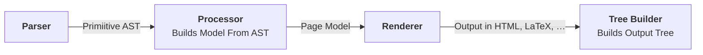

# Phactum&reg; Phase

Phactum Documentation System

### Syntax Sample
```css
@meta
    @title Example Phase Page
    @author Phactum Softwareentwicklung GmbH
    @version 1.0
@end

@section Welcome!
    This is a section
@end

@table
    @row
        @icol Column 1
        @icol Column 2
        @icol Column 3
        @icol Column 4
    @end
    @row
        @icol Lorem
        @icol Ipsum
        @icol Dolor
        @icol Sit
    @end
@end
```

### Pipeline
