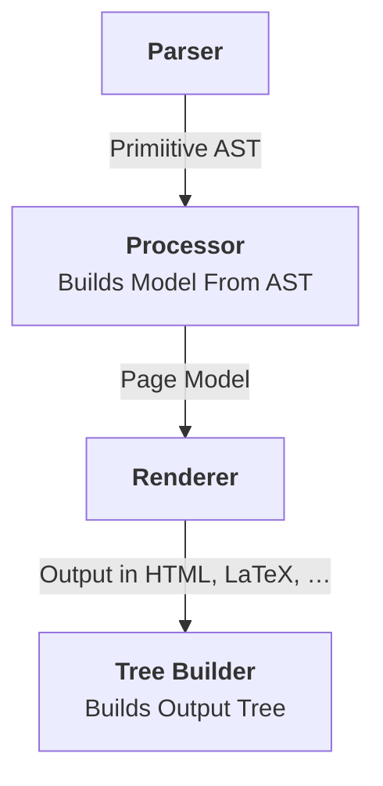

# Phactum&reg; Phase

Phactum Documentation System

### Pipeline

```mermaid
flowchart TD
    Parser["<b>Parser</b>"] -->|Primiitive AST| Processor["<b>Processor</b><br/>Builds Model From AST"] -->|Page Model| Renderer["<b>Renderer</b>"] -->|" Output in HTML, LaTeX, &hellip; "| Consolidator["<b>Tree Builder</b><br/>Builds Output Tree"]
```