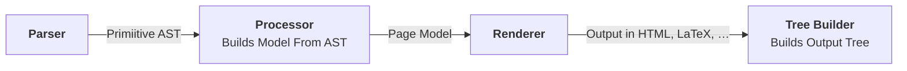

### Usage

Create a new project directory with a `*.phproj` settings file, which defines
global settings for the project.
You can now add `*.phdoc` files, each representing a single documentation
page. The exact directory structure does not matter.

#### Project Settings

The settings file should contain the following schema

```css
@project Phactum Vortex
```

#### Documentation Pages

Every page must contain a metadata block, for example ...

```css
@meta
    @title Recommended Design Practices
    @author Phactum Softwareentwicklung GmbH
    @version 1.0
@end
```

Thereafter, you can write the documentation. You have the control over the
structure and content of every page, but the exact layout and appearance depends
on the specific renderer used.

```css
@section Hello World
    This is the content of a section
@end

@table
    @row
        @icol Column 1
        @icol Column 2
        @icol Column 3
        @icol Column 4
    @end
    @row
        @icol Lorem
        @icol Ipsum
        @icol Dolor
        @icol Sit
    @end
@end
```

### Pipeline

